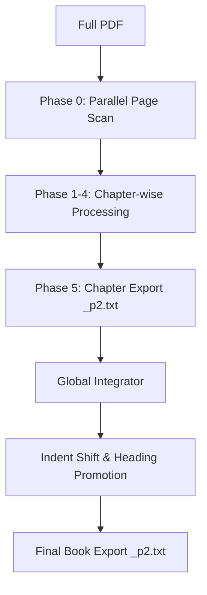

# P2Workflowy 技術的設計文脈 (p2workflowy-context)

## 1. データの型 (Core Data Models)
パイプラインを流れるデータの最小単位と構造。

- **RawChunk**: `page_num`, `bbox` (物理座標), `text`, `font_info` (name, size, flags) を含む抽出最小単位。
- **TreeNode**: 
    - `id`: `raw_text` のハッシュ値（決定論的）。
    - `text`: ノードの文字列。
    - `role`: `h1`-`h4`, `p`, `note`, `list_item` 等の論理的役割。
    - `children`: `List[TreeNode]` (再帰的構造)。
    - `metadata`: オリジナルの座標やフォント情報を含む `Dict`。

## 2. 物理判定の定数 (Deterministic Thresholds)
VLM の判断を補強・検証するための幾何学的数値。詳細は [Rule 02](file:///Users/shufujita/Antigravity/p2workflowy/.agent/rules/02_geometric_vlm_rules.md) を参照。

- **Heading Size**: `(font_size >= 1.05 * mode_size)`
- **Emphasis**: `font_name.contains('Bold', 'Heavy') || is_italic`
- **Mapping**: `IoU > 0.80` (同一性判定の閾値)

## 3. 書籍モードの統合アーキテクチャ (Book Mode Flow)
各章（Chapter）のエクスポート結果（_p2.txt）を、テキストレベルで「単純積み上げ」するフロー。

- **ID Prefixing**: 章ごとの ID に `chN_` プレフィックスを付与し、最終的な Workflowy でのノード衝突を回避する。
- **Heading Promotion**: 論文としては H1 で出力された章タイトルを、書籍統合時に H2（またはそれ以下）へランクダウンさせつつ、章見出しを H1/H2 へ昇格させる。

## 4. 設計思想の根底
- **Immutable State**: 各フェーズは `state/phaseN_output.json` を非破壊的に生成し、不変性を保つこと。
- **Separation of Concerns**: パイプライン（骨組）は Python、肉付け（翻訳・要約）は LLM、という役割分担を崩さないこと。
- **Standard Suffix**: すべての成果物には `_p2` を付けることが品質の証である。

## 5. Phase 4 翻訳における並列ペーシング (Global Optimum)
V3 (Golden Rewrite) における Phase 4 (翻訳) では、Gemini 3 Flash Preview の「Thinking: High ＋ 長大コンテキスト（8万文字）」使用時に発生する **API側での 240秒の強制キューイング（塩漬け）** に対応するため、以下の原則を遵守すること。

- **直列化（Context Chaining）の禁止**: 前のセクションの完了を待つ直列化は、毎回 240秒 のペナルティを連続で食らい、全体の処理時間を1時間規模に破壊するため、**絶対に採用してはならない**。
- **並列相殺 (Scatter-Gather) の強制**: `parallel_translator.py` における `max_concurrent_sections = 4` の設定を用いた一斉並列送信を「Global Optimum」とする。これにより、全セクションの待機時間を並列で一括相殺（約10分内の完走）しつつ、制限帯域（TPM）の安全圏を確保する。
